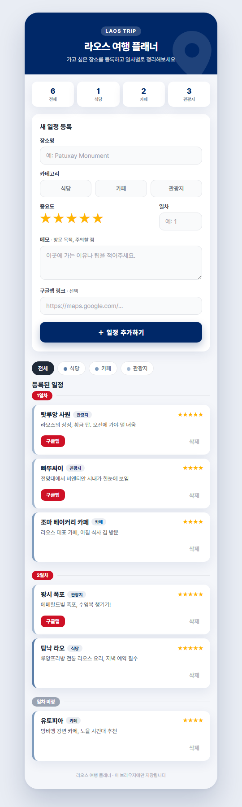

# 라오스 여행 플래너.

> 가고 싶은 곳을 하나씩 담아 일차별로 정리하는, 나만의 라오스 여행 플래너

**Live Demo** : https://heiyeong.github.io/laos-trip-planner/



<br>

## 소개

라오스 여행을 준비하며 가고 싶은 식당 · 카페 · 관광지를 미리 모아두고, 일차별로 동선을 정리하고 싶은 사람들을 위한 여행 계획 웹앱

- **기록하는 것들** : 장소명 · 카테고리 · 중요도 · 일차 · 메모 · 구글맵 링크
- **일차별 정리** : 등록한 장소가 1일차, 2일차… 순서로 자동 그룹핑되어 여행 동선이 한눈에 보임
- 별도의 회원가입 없이 **브라우저에서 바로 시작**

<br>

## 주요 기능

장소를 등록 → 일차별로 정리된 목록을 확인 → 카테고리로 걸러보고 → 구글맵으로 바로 이동하는 흐름으로 구성

| 기능 | 설명 |
| --- | --- |
| 일정 등록 | 장소 · 카테고리 · 중요도 · 일차 · 메모와 함께 등록 |
| 일차별 목록 | 1일차, 2일차… 순서로 자동 정리, 일차 미정 그룹 지원 |
| 카테고리 필터 | 식당 · 카페 · 관광지별로 모아보기 |
| 통계 바 | 전체 · 식당 · 카페 · 관광지 개수 실시간 집계 |
| 구글맵 연동 | 등록한 링크로 구글맵 새 탭 바로가기 |

### 기록 항목

- **장소명 · 카테고리**(식당 · 카페 · 관광지) **· 중요도**(별점 1~5) **· 일차 · 메모 · 구글맵 링크**

<br>

## 기술 스택

- **Frontend** : HTML / CSS / Vanilla JavaScript (별도 프레임워크·빌드 도구 없이 단일 페이지로 구성)
- **저장소** : 브라우저 localStorage — 별도 서버 없이 브라우저에 기록 저장, Google Apps Script 웹앱 URL을 연결하면 구글 시트에도 함께 기록 가능
- **폰트** : Pretendard — 한글 최적화 웹폰트로 가독성 확보
- **컬러** : 라오스 국기의 파랑을 포인트로 한 플랫 컬러 팔레트 (카테고리는 채도를 낮춘 블루 톤 3단계)

<br>

## 프로젝트 구조

```
├─ index.html                 # 앱 본체 (일정 등록 · 일차별 목록 · 필터 · 통계)
├─ screenshots.png            # README용 앱 화면 미리보기
└─ README.md                  # 프로젝트 소개 문서
```

<br>

## 로컬에서 실행하기

빌드 과정이 없는 정적 페이지이므로 `index.html`을 바로 브라우저로 열거나, 정적 파일 서버로 띄우면 됨

```bash
npx serve .
```

구글 시트 연동을 사용하려면 `index.html` 하단 스크립트의 `SCRIPT_URL`을 자신의 Google Apps Script 배포 URL로 교체 필요

```js
const SCRIPT_URL = '여기에_복사한_웹앱_URL을_붙여넣으세요';
```
